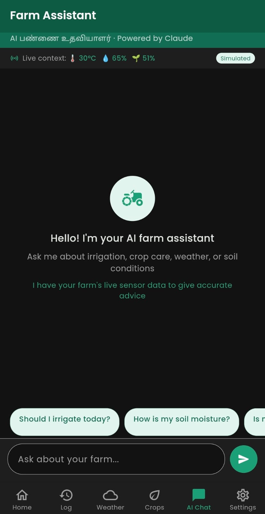
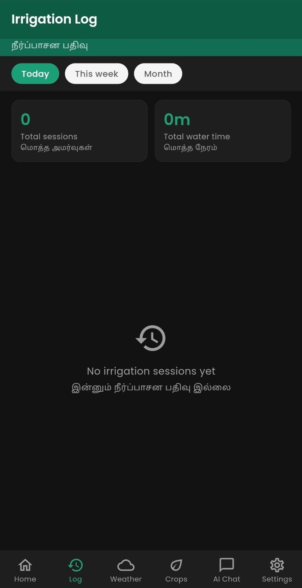
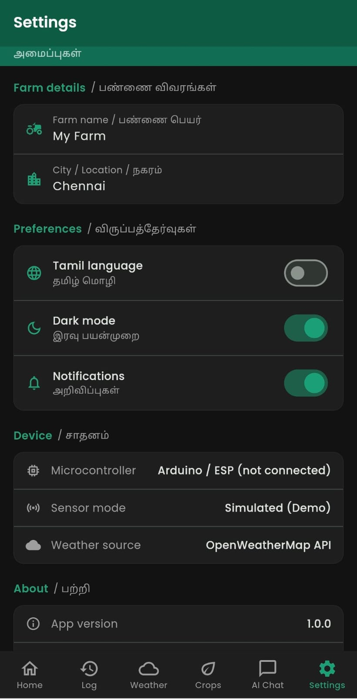

# 🌱 AgroSmart — Smart Irrigation Companion

> An intelligent Flutter app that helps farmers manage irrigation using real-time sensor data, AI-powered crop advice, weather forecasting, and bilingual support in English and Tamil.

🔗 **[Live Demo](https://Madhusaravanan1030.github.io/agroSmart/)** &nbsp;|&nbsp; 📱 **[Download APK](#installation)**

---

## 📱 Screenshots

<!-- Take screenshots from your phone and save them in a screenshots/ folder -->
<!-- Then remove the comment tags around the img tags below -->

| Dashboard | Weather | Crop Advisor |
|:---------:|:-------:|:------------:|
|  |  |  |
| *Sensor metrics and motor control* | *7-day irrigation schedule* | *Bilingual crop tips* |

| AI Chat | Irrigation Log | Dark Mode |
|:-------:|:--------------:|:---------:|
|  |  |  |
| *AI farm assistant in Tamil* | *Session history with filters* | *Full dark mode support* |

---

## ✨ Features

### 🏠 Dashboard
- Live sensor metrics — temperature, humidity, soil moisture, last irrigation time
- Motor control with **Auto mode** and **Manual override**
- Real-time weather summary with rain skip alerts
- Arduino/ESP connection placeholder for real hardware integration
- Simulated sensor data with realistic drift for demo mode

### 📋 Irrigation Log
- Full session history stored locally with **SQLite**
- Filter by Today / This Week / This Month
- Session stats — total sessions and total water time
- Swipe to delete individual log entries
- Auto and manual mode tracking with status badges (Completed, Skipped, Running, Upcoming)

### 🌦️ Weather & Scheduler
- Live weather from **OpenWeatherMap API**
- **7-day irrigation plan** — auto-skips irrigation on rainy days
- Rain probability bar for each day
- Pull-to-refresh weather data
- Weekly rain skip summary

### 🌿 Crop Advisor
- Offline **rules-based AI engine** — works without internet
- Bilingual tips in **English + Tamil**
- Supports 6 crops: Rice, Tomato, Onion, Chilli, Banana, Cotton
- Advice based on live soil moisture, temperature, and rain forecast
- Add and remove crops with persistent storage

### 🤖 AI Farm Assistant
- Powered by **Groq API** (Llama 3.1 8B Instant)
- Tamil and English language support
- Live sensor context injected into every conversation
- 6 quick-reply suggestions for common farming questions
- Animated typing indicator and multi-turn conversation memory
- Secure proxy server on Render — API key never exposed in app

### 📈 Water Usage Charts
- Daily, weekly, and monthly irrigation charts
- Built with **fl_chart**
- Total water time and session count per period
- Interactive bar charts with tap tooltips

### 🔔 Push Notifications (Mobile)
- Rain forecast alerts — notifies before irrigation is auto-skipped
- Soil moisture low alerts — recommends starting irrigation
- Motor start and stop confirmations
- Powered by **flutter_local_notifications**

### 🌙 Dark Mode
- Full dark and light theme toggle
- Persists across app restarts using **SharedPreferences**
- All screens, cards, and charts adapt automatically

### 🗣️ Bilingual UI — English + Tamil
- Language toggle in Settings
- Tamil quick replies in the AI chatbot
- All sensor labels, tips, and status messages in both languages

---

## 🛠️ Tech Stack

### Frontend
| Technology | Version | Purpose |
|---|---|---|
| **Flutter** | 3.44 | Cross-platform mobile and web framework |
| **Dart** | 3.9 | Programming language |
| **Provider** | 6.1.5 | State management |
| **Material Design 3** | — | UI components and theming |

### Data & Storage
| Technology | Version | Purpose |
|---|---|---|
| **sqflite** | 2.4.2 | Local SQLite database for irrigation logs |
| **shared_preferences** | 2.5.3 | Persistent settings storage |
| **path** | 1.9.1 | File path utilities |

### APIs & Services
| Technology | Purpose |
|---|---|
| **OpenWeatherMap API** | Live weather and 5-day forecast |
| **Groq API — Llama 3.1** | AI farm assistant chatbot |
| **Node.js + Express** | Proxy server to secure Groq API key |
| **Render.com** | Free proxy server hosting |

### UI & Visualization
| Technology | Version | Purpose |
|---|---|---|
| **fl_chart** | 0.70.2 | Water usage bar charts |
| **intl** | 0.20.2 | Date and time formatting |
| **Poppins** | — | Custom font family |

### Notifications
| Technology | Version | Purpose |
|---|---|---|
| **flutter_local_notifications** | 18.0.1 | Push notifications on mobile |

### DevOps & Deployment
| Technology | Purpose |
|---|---|
| **GitHub Actions** | CI/CD — auto builds and deploys on every push |
| **GitHub Pages** | Free web hosting |
| **Git** | Version control |

---

## 🏗️ Architecture

```
agrosmart/
├── lib/
│   ├── core/
│   │   ├── theme/           # AppTheme — colors, dark/light mode
│   │   ├── constants/       # App constants, crop rules, API URLs
│   │   └── localization/    # English and Tamil string maps
│   │
│   ├── data/
│   │   ├── models/          # SensorData, IrrigationLog, Crop
│   │   ├── database/        # SQLite helper (DatabaseHelper)
│   │   └── services/        # WeatherService, ChatService,
│   │                        # MockSensorService, NotificationService
│   │
│   ├── providers/           # State management — Provider pattern
│   │   ├── sensor_provider.dart
│   │   ├── irrigation_provider.dart
│   │   ├── weather_provider.dart
│   │   ├── crop_provider.dart
│   │   ├── chat_provider.dart
│   │   └── theme_provider.dart
│   │
│   ├── screens/
│   │   ├── dashboard/       # Home — sensor metrics and motor control
│   │   ├── log/             # Irrigation session history
│   │   ├── weather/         # 7-day forecast and irrigation plan
│   │   ├── advisor/         # Bilingual crop tips
│   │   ├── chat/            # AI farm assistant chatbot
│   │   ├── charts/          # Water usage charts
│   │   └── settings/        # App preferences and toggles
│   │
│   └── widgets/             # Reusable components
│       ├── sensor_card.dart
│       ├── motor_toggle.dart
│       └── weather_day_row.dart
│
├── android/                 # Android native configuration
├── .github/workflows/       # GitHub Actions CI/CD pipeline
└── agrosmart-proxy/         # Node.js proxy server (separate repo)
```

### State Management Flow
```
UI Widget
    │  context.watch<Provider>()
    ▼
ChangeNotifier Provider
    │  calls Service / Database
    ▼
Service / DatabaseHelper
    │  HTTP request / SQLite query
    ▼
External API / Local Storage
```

### Secure API Architecture
```
Flutter App  ──►  Render Proxy  ──►  Groq API
                  (key stored        (AI response)
                   here only)
```

---

## 🔧 Hardware Integration

This app was built as the mobile interface for a real smart irrigation system:

| Component | Purpose |
|---|---|
| Arduino / ESP8266 | Main microcontroller |
| DHT11 sensor | Temperature and humidity readings |
| Capacitive soil moisture sensor | Soil moisture percentage |
| 5V mini water pump | Irrigation motor |
| 5V relay module | Motor switching |

> The app runs in **Simulated Demo mode** when hardware is not connected. Sensor values drift realistically every 10 seconds to simulate live hardware readings. Real sensor data replaces simulated data automatically once connected via Bluetooth or WiFi.

---

## 🚀 Getting Started

### Prerequisites
- Flutter 3.44 or higher
- Android Studio or VS Code with Flutter extension
- Android device or emulator (API 21+)
- Free OpenWeatherMap API key — [openweathermap.org/api](https://openweathermap.org/api)
- Free Groq API key — [console.groq.com](https://console.groq.com)

### Clone and Run

```bash
# 1. Clone the repository
git clone https://github.com/Madhusaravanan1030/agroSmart.git
cd agroSmart

# 2. Install Flutter dependencies
flutter pub get

# 3. Run on your device or emulator
flutter run \
  --dart-define=GROQ_API_KEY=your_groq_key \
  --dart-define=WEATHER_API_KEY=your_weather_key
```

### Build APK for Android

```bash
flutter build apk --release \
  --dart-define=GROQ_API_KEY=your_groq_key \
  --dart-define=WEATHER_API_KEY=your_weather_key
```

APK saved at:
```
build/app/outputs/flutter-apk/app-release.apk
```

### Build for Web

```bash
flutter build web --release \
  --base-href "/agroSmart/" \
  --dart-define=GROQ_API_KEY=your_groq_key \
  --dart-define=WEATHER_API_KEY=your_weather_key
```

> Web deployment is fully automated — just push to `main` and GitHub Actions handles the build and deploy.

---

## 🔐 API Keys and Security

| Variable | Source | Purpose |
|---|---|---|
| `WEATHER_API_KEY` | [openweathermap.org](https://openweathermap.org/api) | Weather data |
| `GROQ_API_KEY` | [console.groq.com](https://console.groq.com) | AI chatbot |

**Security approach:**
- Keys are injected at build time using `--dart-define` — never written in source code
- Groq key is stored only on the Render proxy server — never compiled into the app
- GitHub Secrets store keys for the automated CI/CD pipeline
- No keys appear in the GitHub repository at any point

---

## 🌐 Deployment Pipeline

```
Push to main
     │
     ▼
GitHub Actions triggered
     │
     ├── Install Flutter 3.44
     ├── flutter pub get
     ├── flutter build web (keys injected from GitHub Secrets)
     ├── Add .nojekyll
     └── Deploy to gh-pages branch
              │
              ▼
     GitHub Pages serves the app
     https://Madhusaravanan1030.github.io/agroSmart/
```

---

## 📊 App Screens

| Tab | Screen | Key Features |
|---|---|---|
| 🏠 Home | Dashboard | Sensor metrics, motor control, weather snapshot |
| 📋 Log | Irrigation Log | Session history, date filters, swipe to delete |
| 🌦️ Weather | Weather & Schedule | Live weather, 7-day plan, rain alerts |
| 🌿 Crops | Crop Advisor | Bilingual tips, crop picker, offline engine |
| 🤖 AI Chat | Farm Assistant | Groq chatbot, Tamil mode, quick replies |
| ⚙️ Settings | Settings | Farm name, city, language, dark mode |

---

## 🤝 Contributing

This is a portfolio project but suggestions are welcome:

1. Fork the repository
2. Create a feature branch — `git checkout -b feature/your-feature`
3. Commit your changes — `git commit -m 'Add feature'`
4. Push to the branch — `git push origin feature/your-feature`
5. Open a Pull Request

---

## 📄 License

This project is licensed under the MIT License.

---

## 👨‍💻 Author

**Madhu Saravanan**
- GitHub: [@Madhusaravanan1030](https://github.com/Madhusaravanan1030)
- Live Demo: [madhusaravanan1030.github.io/agroSmart](https://Madhusaravanan1030.github.io/agroSmart/)

---

## 🙏 Acknowledgements

- [Flutter](https://flutter.dev) — cross-platform UI framework
- [Groq](https://groq.com) — blazing fast AI inference
- [OpenWeatherMap](https://openweathermap.org) — weather data API
- [fl_chart](https://pub.dev/packages/fl_chart) — Flutter chart library
- [Provider](https://pub.dev/packages/provider) — Flutter state management

---

*Built with Flutter 🐦 &nbsp;·&nbsp; Deployed on GitHub Pages 🌐 &nbsp;·&nbsp; AI powered by Groq ⚡*