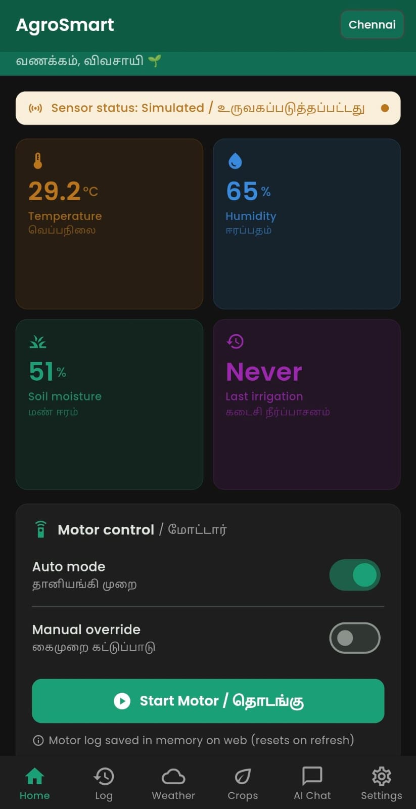
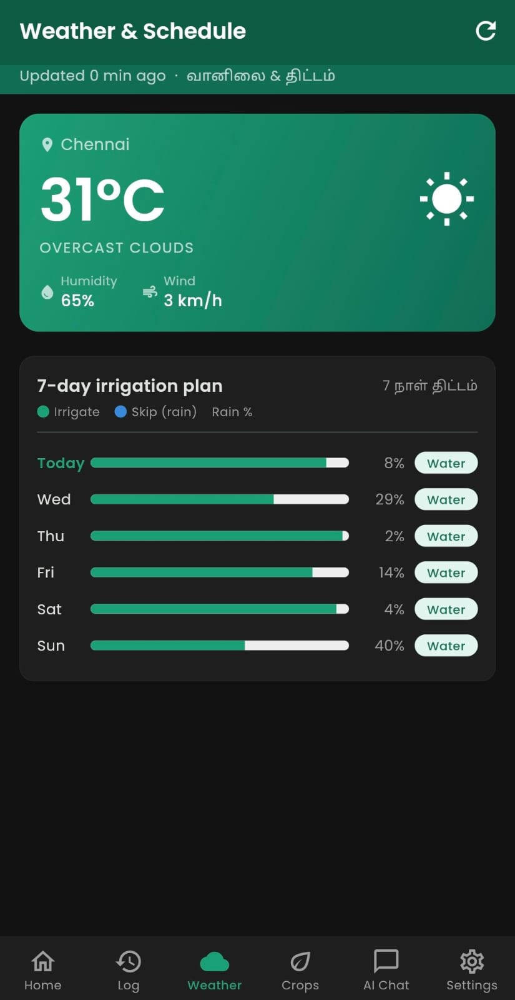
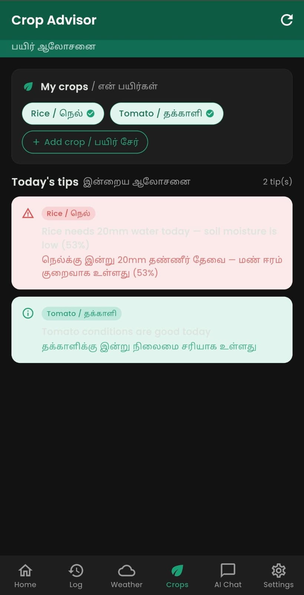

# 🌱 AgroSmart — Smart Irrigation Companion

A Flutter app that helps farmers manage irrigation intelligently using weather data, AI crop advice, and automated motor control.

🔗 **[Live Demo](https://Madhusaravanan1030.github.io/agrosmart/)**

---

## Features

| Feature | Description |
|---|---|
| 📊 Sensor Dashboard | Live temperature, humidity, soil moisture (simulated) |
| 💧 Motor Control | Auto and manual irrigation modes |
| 📋 Irrigation Log | Session history stored locally with SQLite |
| 🌦️ Weather Scheduler | 7-day forecast — auto skips irrigation before rain |
| 🌿 Crop Advisor | Offline bilingual tips in English + Tamil |
| 📈 Water Charts | Daily / weekly / monthly usage charts |
| 🔔 Notifications | Rain alerts and soil moisture warnings |
| 🤖 Disease Detection | AI leaf scanner (demo mode) |
| 🌙 Dark Mode | Full dark/light theme toggle |

## Tech Stack

- **Flutter 3.44** + Dart 3.9
- **Provider** — state management
- **sqflite** — local SQLite database
- **OpenWeatherMap API** — weather and forecast
- **fl_chart** — data visualization
- **flutter_local_notifications** — push alerts

## Hardware (Physical Project)

This app was built as the mobile interface for a smart irrigation system using:
- Arduino / ESP8266 microcontroller
- DHT11 temperature and humidity sensor
- Soil moisture sensor
- Water pump with relay module

The app runs in **demo mode** with simulated sensor data when hardware is not connected.

## Setup

```bash
# Clone the repo
git clone https://github.com/YOUR_USERNAME/agrosmart.git
cd agrosmart

# Add your API key
cp lib/core/constants/app_constants.example.dart lib/core/constants/app_constants.dart
# Edit app_constants.dart and paste your OpenWeatherMap API key

# Install dependencies
flutter pub get

# Run
flutter run
```

## Screenshots

| Dashboard | Weather | Crop Advisor |
|---|---|---|
|  |  |  |

---

Built with Flutter · Deployed on GitHub Pages